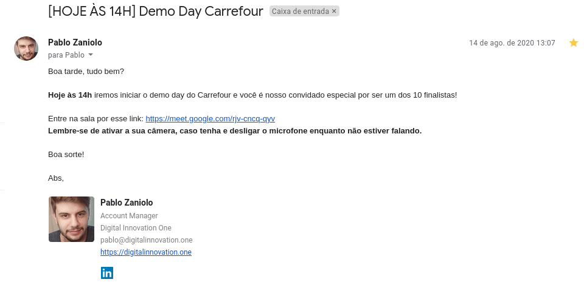

 # Resolução do projeto: solução técnica que otimize a comunicação entre clientes e o Carrefour
> Tech Challenge Carrefour- Digital Innovaton One e Carrefour



### 1) Telegram
- [https://web.telegram.org/](https://web.telegram.org/)
#### Criando o bot
	- Se inscreva no Telegram (Você pode usar o cliente web, desktop ou mobile)
	- Abra o aplicativo ou acesse o website
	- Pesquise por @BotFather e inicie a conversa
	- Envie o comanndo /newbot e execute as instruções
	- Armazene o token enviado pelo @BotFather (Vamos usá-lo no código)
### 2) Bibliotecas utilizadas no projeto
- [https://www.npmjs.com/package/dialogflow](https://www.npmjs.com/package/dialogflow) (Comunicação com o Dialogflow)
- [https://www.npmjs.com/package/node-telegram-bot-api](https://www.npmjs.com/package/node-telegram-bot-api) (Comunicação com o Telegram)

### 3) Dialogflow
- [https://dialogflow.com/](https://dialogflow.com/)
Caso queira usar a mesma base de dados do dialogflow:
Entre nas configuração do seu projeto, vá para aba importar e exportar e cole a pasta `Carrefour_bot- agent backup/` no drop files

### 4) dev carrefour
- [https://dev.carrefour.com.br/](https://dev.carrefour.com.br/)

### 5) Tomtom
- [https://developer.tomtom.com/](https://developer.tomtom.com/)

### 6) Gerar credenciais
- [https://console.cloud.google.com/iam-admin/serviceaccounts](https://console.cloud.google.com/iam-admin/serviceaccounts) (Dialogflow) Lembrar de ir na conta de serviço criada pelo Dialogflow e gerar seu arquivo json com as credenciais
- [https://dev.carrefour.com.br/node/107](https://dev.carrefour.com.br/node/107) (Carrefour) Lembrar de ativar a api no botão assinar
- [https://developer.tomtom.com/user/me/apps](https://developer.tomtom.com/user/me/apps) (Tomtom)

### 7) Rodar o projeto
```bash
- Efetuar o clone do repositório em uma pasta do sistema operacional
- Executar o comando `yarn install ou npm install` dentro da pasta raiz do projeto para baixar as dependências
- Substituir os arquivos de credenciais do carrefour_bot, tokenBotFather e do apiCarrefour
- Executar o comando `yarn start` dentro da pasta raiz do projeto para executar o código
```

###  8)Veja todas as funcionalidade
- [https://www.youtube.com/watch?v=AkufDDE5Msc](https://www.youtube.com/watch?v=AkufDDE5Msc)
